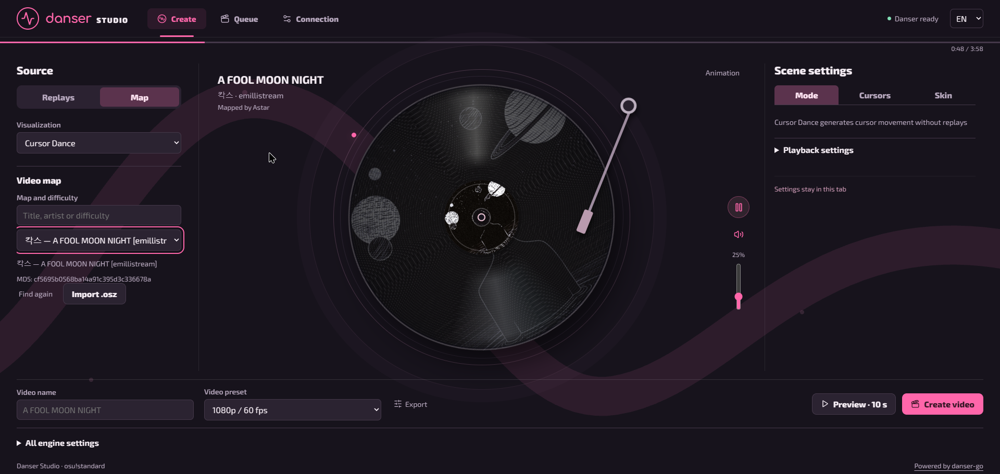

# Danser Studio · v0.3.0

A local video studio for **osu!standard**, built on [danser-go](https://github.com/Wieku/danser-go). Create videos from replays or visualize a map with Cursor Dance / Autoplay. Available in English and Russian.



## Features

- Import `.osr` attempts of one exact map version, matched by MD5.
- Use maps from stable Songs, read-only lazer storage, or `.osz` imports.
- Choose comparison modes, elimination rules, date gradients, player colors, and individual overrides.
- Load local skins or `.osk` archives; keep access to all engine settings.
- Export MP4/MKV, make short video previews or PNG screenshots, and manage jobs with progress, logs, cancellation, and retry.
- Listen from the map's `PreviewTime`, with seeking, volume, mute, and optional animation.

Settings stay in the browser tab session. Uploaded replay copies are deleted after successful full renders once other jobs no longer need them. Preview, errors, and cancellation keep the copies; original files are untouched.

## Setup — Windows x64

Requires **Node.js 24+**, **FFmpeg/ffprobe**, and the Studio engine with its runtime assets. There is no installer yet.

```powershell
git clone https://github.com/ilyaminch/danser-go-webui.git
cd danser-go-webui/web
npm ci
npm run build
cd ..
```

1. Extract the Windows x64 [danser-go 0.12.0 archive](https://github.com/Wieku/danser-go/releases/tag/0.12.0) into `runtime/`, preserving assets and DLLs.
2. Place Go 1.26.1 at `.tools/go/` and WinLibs GCC x64 (POSIX, MSVCRT; tested with 16.2.0) at `.tools/mingw64/`. Run `./Build-Engine.ps1` to build `runtime/danser-studio.exe`.
3. For lazer support, install .NET SDK 9+ and run `./Build-LazerIndex.ps1`.
4. Open `Start-Studio.cmd`, then configure FFmpeg and map sources under **Connection** at **http://127.0.0.1:3000**.

## Use

Under **Create**, import replays or choose **Map** and a visualization mode. Set the engine mode, cursor colors, and skin; choose a video preset, optionally preview, then create the video. Results appear in **Queue**. Detailed encoding options and engine settings remain available below the workspace.

Replay videos retain recorded mods. CS/AR/OD/HP overrides apply only to map visualization. Default recording uses NVENC; select libx264 if hardware encoding is unavailable.

## Development

From `web/`:

```powershell
npm run dev
npm test
npm run build
```

Engine integration checks are in `web/test/integration.mjs` and require the engine, assets, and FFmpeg. Local data lives in `web/data/`; runtime, credentials, generated media, and development notes are excluded from Git.

## Limitations and license

One map per video; no automatic map download, editing across maps, or render pause. The tested platform is Windows; Linux packaging is untested and upstream does not support macOS. Compatibility with every lazer replay/mod combination is not guaranteed.

This is an unofficial companion with a modified engine. See the [engine documentation](danser-go/README.md), [credits](danser-go/CREDITS.md), [asset notices](web/public/ASSETS.md), and [GPL-3.0 license](LICENSE). The `v0.2.0` tag preserves the version before the frontend redesign.
